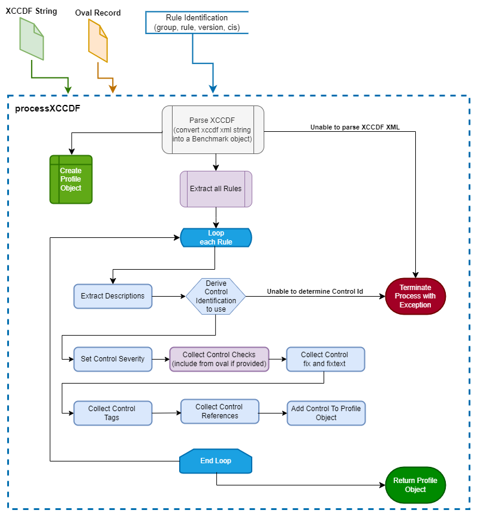
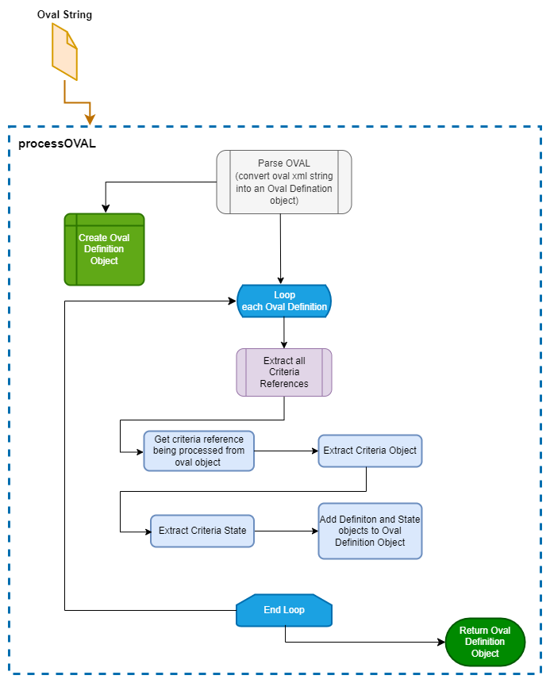
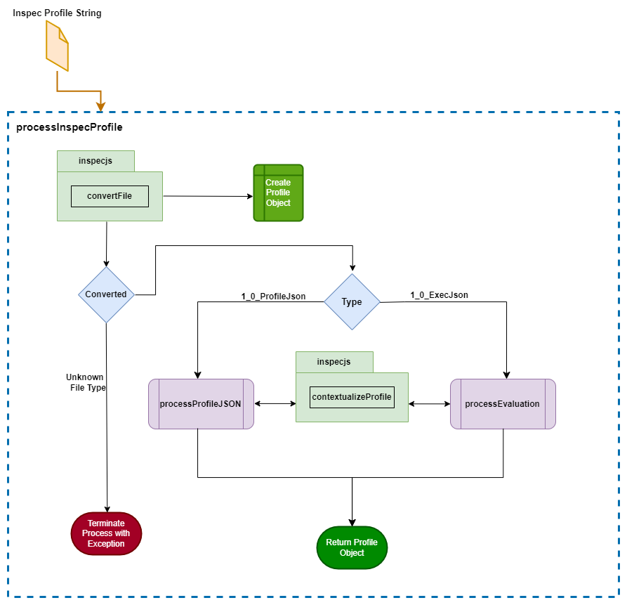
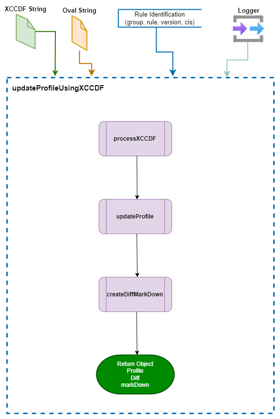
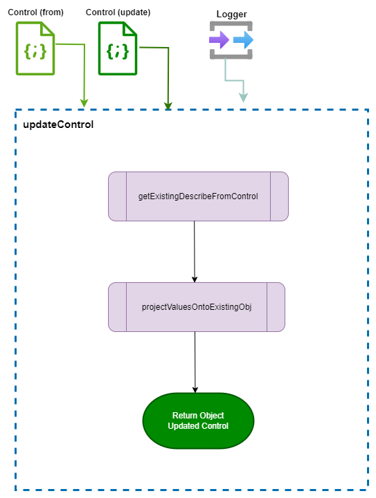

# ts-inspec-objects
Typescript objects for InSpec Profiles

This repository contains the source code that facilitates the writing of InSpec Profiles (for use in things like stub generation and delta comparisons) more consistent with `Chef Cookstyle` formatting for ease of use when comparing with new changes from delta and when generating InSpec stubs that match a standard format. 

For more information about Chef Cookstyle see: 
 - [chef/cookstyle on GitHub](https://github.com/chef/cookstyle)
 - [Chef Cookstyle on Chef documents page](https://docs.chef.io/workstation/cookstyle/)

The `ts-inspec-objects` provides the capability of updating InSpect Profiles and creating stub Profiles based on XCCDF Benchmarks. This is accomplished by providing `Profile` and `Control` classes and supporting methods (functions).

## How to Use
The process code maintained in this repository generates a `npm` executable that is published to the `npm registry` as [mitre-inspec-objects](https://www.npmjs.com/package/@mitre/inspec-objects).

To use the `mitre-inspec-objects` npm package, simply add the package as a dependency to your project application using the npm install command:
```
npm install mitre-inspec-objects
```
The package is a CommonJS-based npm written in TypeScript 

## Parsing Process

When using this library to parse `InSpec Profiles` or `xccdf files` for the purposes of generating InSpec profiles, the general workflow is as follows:
```
  - The input is processed, read into a typescript object
  - Operated on with any required action / logic
  - Then written into an InSpec profile as output. 
```
This means that we can not simply write out in the same format we got in. Instead, we have to make choices about formatting for how to write out content.

Here are some formatting choices that are being made.

1. String quotation

      | The string contains | Use	|
      |--------	|--------------------	|
      | single (') and double (") quotes| percent string syntax - %q() |
      | single (') quotes | double (") quotes |
      | other | single (') quotes	|

2. Tag keywords are not quoted (ex: tag severity: 'medium')
3. Each control file ends with a newline

---
### XCCDF Workflow Process
Processes an XCCDF (Extensible Configuration Checklist Description Format) XML string based on the `Rule Identifier` provided and converts it into a Profile object.
If and OVAL definition is provided it retrives the oval objects and associated states and the Controls description check text is update with the content.
<div align="center">
  
</div>

### OVAL Workflow Process
Processes an OVAL (Open Vulnerability and Assessment Language) XML string and converts it into a JSON object.
The process extracts definitions and their associated criteria references and resolved values.
The process executes the following steps:
1. Converts the OVAL XML string into a JSON object.
2. Iterates through the OVAL definitions and extracts each definition.
3. For each definition, extracts criteria references and resolves the associated objects and states.
4. Logs warnings if any objects or states cannot be found.
<div align="center">
  
</div>

### InSpec Profile Workflow Process
Process a JSON string representing an InSpec profile, converts it, and processes it to return a `Profile` object.
It handles different versions of the InSpec JSON format and sorts the controls by their ID.
<div align="center">
  
</div>

### Update Profile Using XCCDF Workflow Process
Updates a Profile with new metadata from and XCCDF, based on the `Rule Indetefier` and logs the process.
<div align="center">
  
</div>

### Update Control Workflow Process
Updates a given control object with the provided partial control and logs the process.
<div align="center">
  
</div>

---
## Development Environment Configuration
### Installation
To install the project, clone the repository and install the dependencies:
```bash
# SSH
git clone git@github.com:mitre/ts-inspec-objects.git 
# HTTPS
git clone https://github.com/mitre/ts-inspec-objects.git

cd project
npm install
```

### Compile the project
Use the `build` script command to generate the executable libraries:
```bash
npm run build
```

### Linting the code
Use either the `lint` or `lint:ci` command to invoke the linter:
```bash
# Auto fix
npm run lint

# Display linting findings
npm run lint:ci
```

### Run the Test Suite
Use the `test` script command to run all tests contained in the tests directory:

```bash
npm run test
```

### Run a Specific Test
To run a specific test use the `npx jest --findRelatedTests` command:
```bash
npx jest --findRelatedTests <test\testName.ts>
```
## NOTICE

© 2018-2025 The MITRE Corporation.

Approved for Public Release; Distribution Unlimited. Case Number 18-3678.

## NOTICE

MITRE hereby grants express written permission to use, reproduce, distribute, modify, and otherwise leverage this software to the extent permitted by the licensed terms provided in the LICENSE.md file included with this project.

## NOTICE

This software was produced for the U. S. Government under Contract Number HHSM-500-2012-00008I, and is subject to Federal Acquisition Regulation Clause 52.227-14, Rights in Data-General.

No other use other than that granted to the U. S. Government, or to those acting on behalf of the U. S. Government under that Clause is authorized without the express written permission of The MITRE Corporation.

For further information, please contact The MITRE Corporation, Contracts Management Office, 7515 Colshire Drive, McLean, VA 22102-7539, (703) 983-6000.
