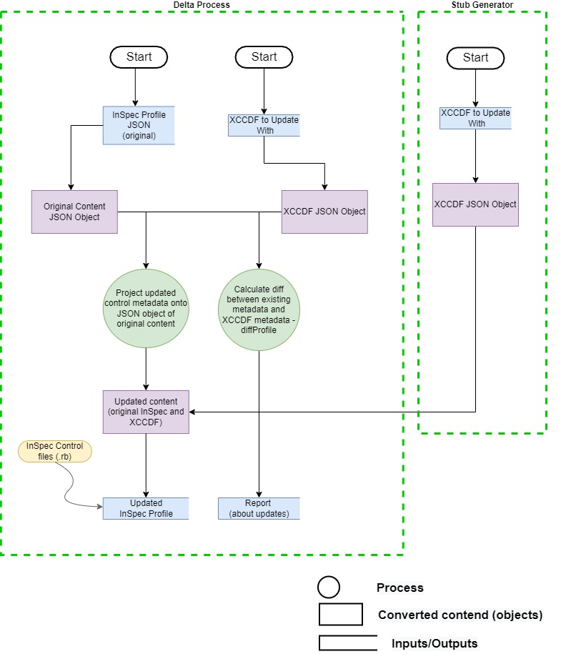

# ts-inspec-objects
Typescript objects for InSpec profiles

This repository contains the source code that facilitates the writing of InSpec profiles (for use in things like stub generation and delta comparisons) more consistent with `Chef Cookstyle` formatting for ease of use when comparing with new changes from delta and when generating InSpec stubs that match a standard format. 

For more information about Chef Cookstyle see: 
 - [chef/cookstyle on GitHub](https://github.com/chef/cookstyle)
 - [Chef Cookstyle on Chef documents page](https://docs.chef.io/workstation/cookstyle/)

## How to Use
The process code maintained in this repository generates a `npm` executable that is published to the `npm registry` as [mitre-inspec-objects](https://www.npmjs.com/package/@mitre/inspec-objects).

To use the `mitre-inspec-objects` npm package, simply add the package as a dependency to your project application using the npm install command:
```
npm install mitre-inspec-objects
```
The package is a CommonJS-based npm written in TypeScript 

## Parsing Process

When using this library to parse `InSpec profiles` or `xccdf files` for the purposes of generating InSpec profiles, the general workflow is as follows:
```
  - The input is processed, read into a typescript object
  - Operated on with any required action / logic
  - Then written into an InSpec profile as output. 
```
This means that we can not simply write out in the same format we got in. Instead, we have to make choices about formatting for how to write out content.

Here are some formatting choices that are being made.

1. String quotation

      | The string contains | Use	|
      |--------	|--------------------	|
      | single (') and double (") quotes| percent string syntax - %q() |
      | single (') quotes | double (") quotes |
      | other | single (') quotes	|

2. Tag keywords are not quoted (ex: tag severity: 'medium')
3. Each control file ends with a newline

### Workflow graphical representation
<div align="center">
  
</div>

### Delta and Stub Process
<div align="center">
  
</div>

### NOTICE

© 2018-2022 The MITRE Corporation.

Approved for Public Release; Distribution Unlimited. Case Number 18-3678.

### NOTICE

MITRE hereby grants express written permission to use, reproduce, distribute, modify, and otherwise leverage this software to the extent permitted by the licensed terms provided in the LICENSE.md file included with this project.

### NOTICE

This software was produced for the U. S. Government under Contract Number HHSM-500-2012-00008I, and is subject to Federal Acquisition Regulation Clause 52.227-14, Rights in Data-General.

No other use other than that granted to the U. S. Government, or to those acting on behalf of the U. S. Government under that Clause is authorized without the express written permission of The MITRE Corporation.

For further information, please contact The MITRE Corporation, Contracts Management Office, 7515 Colshire Drive, McLean, VA 22102-7539, (703) 983-6000.
